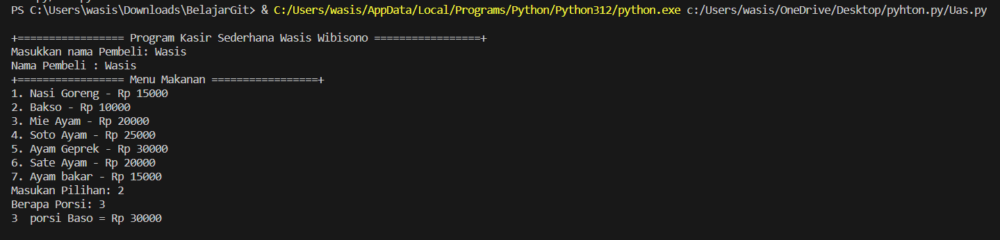
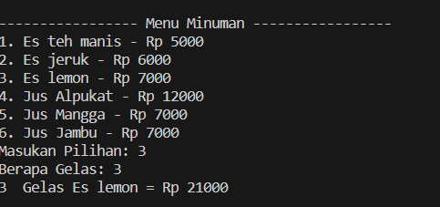

# Project Uas

| NAMA  :| Wasis Wibisono |
| --- | --- |
| NIM   :| 312310661 |
| KELAS :| TI.23.A.6 |
| DOSEN :| Agung Nugroho,S.Kom.,M.Kom |

# Tugas Project Ujian Akhir Semester

## **Program Kasir Di Sebuah Kantin** 

|Link Youtube|  |
| --- | --- |

# Hasil Program Python

# $${\color{Hitam}PENJELASAN}$$

1.Dictionary Harga Menu Makanan dan Minuman
Pada bagian awal program, terdapat sebuah dictionary yang menyimpan opsi pilihan makanan/minuman beserta harganya.

 
 fungsimakanan():
   global totalmkn
   global porsi
   global mkn
   print ("+================= Menu Makanan =================+")
   print("1. Nasi Goreng - Rp 15000")
   print("2. Bakso - Rp 10000")
   print("3. Mie Ayam - Rp 20000")
   print("4. Soto Ayam - Rp 25000")
   print("5. Ayam Geprek - Rp 30000")
   print("6. Sate Ayam - Rp 20000")
   print("7. Ayam bakar - Rp 15000")

  
2.Fungsi Pesan_Makanan(): Fungsi ini merupakan awal dari sebuah fungsi untuk memesan makanan.

def pesan_makanan():
    pesanan = {}
    while True:
        tampilkan_menu(menu)
        pilihan = input("Pilih nomor menu (atau ketik '0' untuk mengakhiri): ")
        
        if pilihan.lower() == '0':
            break
        
        if pilihan in menu:
            jumlah = int(input(f"Jumlah {menu[pilihan]['item']}: "))
            pesanan[menu[pilihan]['item']] = {'jumlah': jumlah, 'harga': menu[pilihan]['harga']}
        else:
            print("Pilihan tidak valid. Silakan pilih nomor menu yang benar.")
    return pesanan

 3.Fungsi hitung_total(pesanan): Fungsi ini digunakan untuk menghitung total biaya dari suatu pesanan. Fungsi ini mengambil satu parameter, yaitu pesanan, yang seharusnya berupa sebuah kamus (dictionary) yang berisi informasi tentang item-item pesanan.

    print("\nTotal harus Dibayar: Rp",totalsemua)
uang=int(input("Uang Tunai Pembeli: Rp "))
kembalian=int(uang-totalsemua)
print("Kembalian :",kembalian)

4.Fungsi cetak_struk(pesanan, total_harga): Fungsi ini bertujuan untuk mencetak struk pembelian berdasarkan informasi pesanan dan total harga yang diberikan sebagai argumen.

print("\n==================================")
print("========== S T R U K   P E M B E L I A N =========")
print("==================================")
print ("Nama\t\t:",pembeli)
print ("Beli\t\t:",porsi,mkn,"( Rp", totalmkn,")")
print ("\t\t ",gelas,mnm,"( Rp", totalmnm,")")
print ("Tagihan\t\t: Rp",totalsemua)
print ("Dibayar\t\t: Rp",uang)
print ("Kembalian\t: Rp",kembalian)
print("==================================")
print("==================================")
